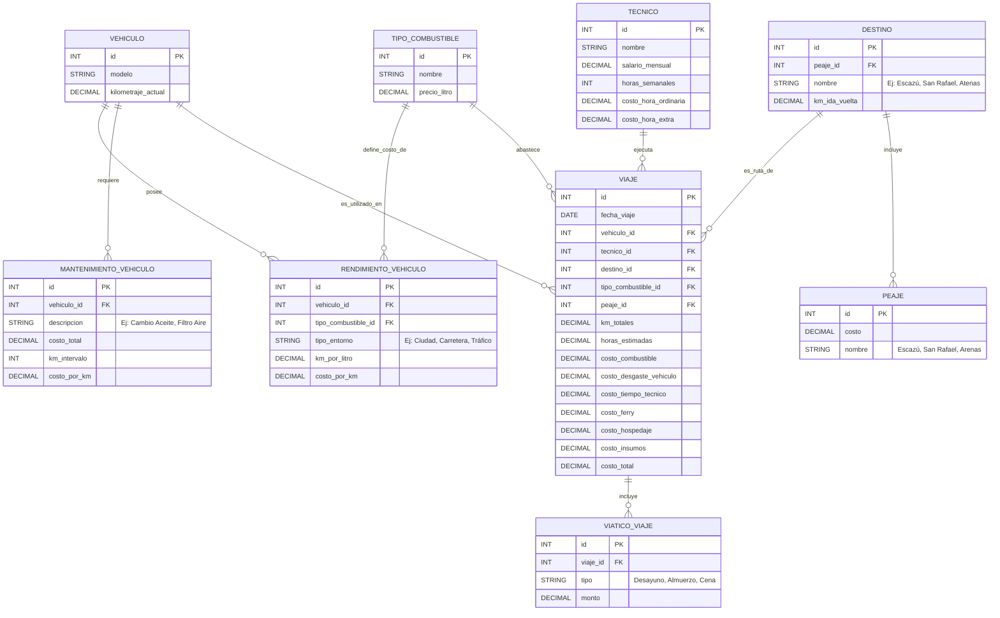

# Sistema Costo Viaje

Sistema de gestión y cálculo de costos de viaje para Grupo IEXCA S.A.

## Tecnologías

- **.NET 10** (Windows Forms)
- **C#** con tipado nulo habilitado
- Arquitectura **MVP** (Model-View-Presenter) multicapa

## Arquitectura

```
sistema-costo-viaje/
├── EL/          # Entity Layer — Modelos de dominio
├── VL/          # Validation Layer — Validación de entidades
├── BL/          # Business Logic Layer — Reglas de negocio y cálculos
├── Presenter/   # Presenter Layer — Puente abstracto entre View y Model
├── View/        # View Layer — Formularios Windows Forms
└── Program.cs   # Punto de entrada
```

## Estado actual

| Componente | Estado |
|---|---|
| `EL/Viaje.cs` — Entidad Viaje con estado (Pendiente, EnCurso, Completado, Cancelado) | ✅ |
| `VL/ViajeValidador.cs` — Validación de datos de entrada | ✅ |
| `BL/ViajeLogicaNegocio.cs` — Cálculo de costos, reglas de hora pico, descuentos, máquina de estados | ✅ |
| `Presenter/puente.cs` — Clase base abstracta `PresenterBase` | ✅ |
| `View/Form1.cs` — Formulario principal (vacío, sin controles) | 🚧 |
| Capa de persistencia (DAL/Repositorio) | ❌ |
| Presenter concreto (ej. `ViajePresenter`) | ❌ |
| CRUD de entidades (Vehículo, Técnico, Destino, Combustible) | ❌ |

## Modelo de datos (Roadmap)



## Roadmap

### Fase 1 — Base del sistema ✅
- [X] Modelo `Viaje` con estados
- [X] Validación de datos de entrada
- [X] Reglas de negocio (cálculo de costo, hora pico, descuento viaje largo)
- [X] Máquina de estados (Pendiente → EnCurso → Completado/Cancelado)
- [X] Clase base abstracta para Presenter (MVP)

### Fase 2 — Interfaz de usuario 🚧
- [ ] Diseñar formulario principal con navegación (menú, toolbar)
- [ ] Formulario de registro de viaje (origen, destino, distancia, conductor, fecha)
- [ ] Listado de viajes
- [ ] Vista de detalle de viaje con desglose de costos
- [ ] Conexión del Presenter concreto a la Vista

### Fase 3 — Catálogos y persistencia
- [ ] Entidad `Vehículo` (CRUD)
- [ ] Entidad `Técnico` (CRUD)
- [ ] Entidad `Destino` (CRUD)
- [ ] Entidad `TipoCombustible` (CRUD)
- [ ] Entidad `RendimientoVehiculo` (CRUD)
- [ ] Entidad `MantenimientoVehiculo` (CRUD)
- [ ] Entidad `ViaticoViaje` (CRUD)
- [ ] Entidad `Peaje` (CRUD)
- [ ] Capa de acceso a datos (DAL) con SQL Server / SQLite
- [ ] Repositorios genéricos

### Fase 4 — Cálculo avanzado de costos
- [ ] Cálculo de costo de combustible según rendimiento vehículo
- [ ] Cálculo de desgaste vehicular por mantenimiento
- [ ] Cálculo de costo de tiempo del técnico (ordinario + extra)
- [ ] Cálculo de viáticos por viaje
- [ ] Resumen de costo total del viaje

### Fase 5 — Reportes y exportación
- [ ] Reporte de costos por viaje
- [ ] Reporte de costos por vehículo
- [ ] Reporte de costos por técnico
- [ ] Exportación a Excel/PDF
- [ ] Dashboard con indicadores

## Licencia

GNU General Public License v3.0 — Ver [LICENSE](LICENSE).
